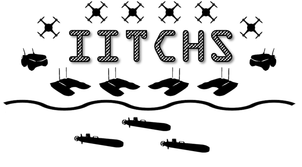

.. iitchs_base documentation master file, created by
   sphinx-quickstart on Tue Aug 10 05:19:30 2021.
   You can adapt this file completely to your liking, but it should at least
   contain the root `toctree` directive.

IITCHS Base
===========

IITCHS Base is a Python3 implementation of the IITCHS framework. It serves as the base package for implementing IITCHS functionality.

.. note::
   IITCHs is currently under active development. Feel free to file an issue on Github if you discover any rough edges!

.. toctree::
   :hidden:
   :maxdepth: 2
   :caption: Contents:

   self
   Installation <README.md>
   Usage <usage.md>
   Custom Scenarios <scenarios.md>
   Temporal Logic Primer <temporal_logic_primer.md>
   Developer Notes <developer_notes/index_developer_notes.rst>
   Source Code Documentation <source_code_index.rst>

Overview
========

Inter- and Intra- Team Coordination From High Level Specifications (IITCHS) Code Base is a software package that allows a single human operator to deploy teams of self-coordinating, heterogeneous, autonomous robotic platforms using high-level specifications.
There is an increasing focus on developing autonomous teams of agents that can cooperate together. This work can roughly be divided into two paradigms: Swarms and Teams. Swarms typically involve large numbers of agents performing behaviors. The swarm as a whole tends to be robust to agent attrition, however swarms typically only contain homogeneous agents and perform relatively simple behaviors or tasks. Teams on the other hand are often composed of fewer heterogeneous agents. Teams typically carry out more complex behavior, but tend to not be robust to agent failure. 

IITCHS Code Base combines the best attributes of both Swarms and Teams. It enables one human operator to supervise and control large heterogeneous teams performing complex behaviors and dynamic tasks, while still being robust and resilient to agent failures and attrition. IITCHS Code Base takes in high-level objectives from a human operator and then automatically decomposes these objectives into precise, low-level plans to be executed by the autonomous robots on the heterogeneous team. In making these plans it takes into account the environment the agents are working in and the differing capabilities of individual team members. The human supervisor only needs to worry about the high-level objectives of the problem at hand without needing to figure out all details of the solution. 

IITCHS is designed to perform well on problems that

* Involve agents with differing sensors or capabilities
* Have complex time and location constraints
* Require plans that will be executed on the order of hours to days

IITCHs may not be the best match for problems that

* Require rapidly changing plans in highly uncertain environments
* Require solutions on the order of subseconds to seconds

Citation Information
====================

.. Please use the following DOI reference number, published on Zenodo, when citing this software:

.. \[INSERT HERE WHEN WE HAVE PUBLIC GITHUB REPO URL\]

Please consider citing the following papers that establish the theoretical basis for IITCHS:

`Scalable and Robust Algorithms for Task-Based Coordination From High-Level Specifications (ScRATCHeS) <https://ieeexplore.ieee.org/document/9663414>`_

BibTeX::

   @article{Leahy2021ScalableAR,
     title={Scalable and Robust Algorithms for Task-Based Coordination From High-Level Specifications (ScRATCHeS)},
     author={Kevin J. Leahy and Zachary T. Serlin and Cristian Ioan Vasile and Andrew Schoer and Austin Jones and Roberto Tron and Calin A. Belta},
     journal={IEEE Transactions on Robotics},
     year={2021}
   }

.. Installation and Usage
   ======================

License
=======

BSD-3-Clause

Copyright 2021 Massachusetts Institute of Technology.

Redistribution and use in source and binary forms, with or without modification, are permitted provided that the following conditions are met:

2. Redistributions of source code must retain the above copyright notice, this list of conditions and the following disclaimer.

3. Redistributions in binary form must reproduce the above copyright notice, this list of conditions and the following disclaimer in the documentation and/or other materials provided with the distribution.

4. Neither the name of the copyright holder nor the names of its contributors may be used to endorse or promote products derived from this software without specific prior written permission.

THIS SOFTWARE IS PROVIDED BY THE COPYRIGHT HOLDERS AND CONTRIBUTORS "AS IS" AND ANY EXPRESS OR IMPLIED WARRANTIES, INCLUDING, BUT NOT LIMITED TO, THE IMPLIED WARRANTIES OF MERCHANTABILITY AND FITNESS FOR A PARTICULAR PURPOSE ARE DISCLAIMED. IN NO EVENT SHALL THE COPYRIGHT HOLDER OR CONTRIBUTORS BE LIABLE FOR ANY DIRECT, INDIRECT, INCIDENTAL, SPECIAL, EXEMPLARY, OR CONSEQUENTIAL DAMAGES (INCLUDING, BUT NOT LIMITED TO, PROCUREMENT OF SUBSTITUTE GOODS OR SERVICES; LOSS OF USE, DATA, OR PROFITS; OR BUSINESS INTERRUPTION) HOWEVER CAUSED AND ON ANY THEORY OF LIABILITY, WHETHER IN CONTRACT, STRICT LIABILITY, OR TORT (INCLUDING NEGLIGENCE OR OTHERWISE) ARISING IN ANY WAY OUT OF THE USE OF THIS SOFTWARE, EVEN IF ADVISED OF THE POSSIBILITY OF SUCH DAMAGE.

Distribution and Disclaimer Statements
======================================

DISTRIBUTION STATEMENT A. Approved for public release. Distribution is unlimited.

This material is based upon work supported by the Under Secretary of Defense for 
Research and Engineering under Air Force Contract No. FA8702-15-D-0001. Any 
opinions, findings, conclusions or recommendations expressed in this material 
are those of the author(s) and do not necessarily reflect the views of the Under 
Secretary of Defense for Research and Engineering.

(C) 2021 Massachusetts Institute of Technology.

Subject to FAR52.227-11 Patent Rights - Ownership by the contractor (May 2014)

The software/firmware is provided to you on an As-Is basis

Delivered to the U.S. Government with Unlimited Rights, as defined in DFARS 
Part 252.227-7013 or 7014 (Feb 2014). Notwithstanding any copyright notice, U.S. 
Government rights in this work are defined by DFARS 252.227-7013 or DFARS 
252.227-7014 as detailed above. Use of this work other than as specifically 
authorized by the U.S. Government may violate any copyrights that exist in this 
work.

Indices and tables
==================

* :ref:`genindex`
* :ref:`modindex`
* :ref:`search`
